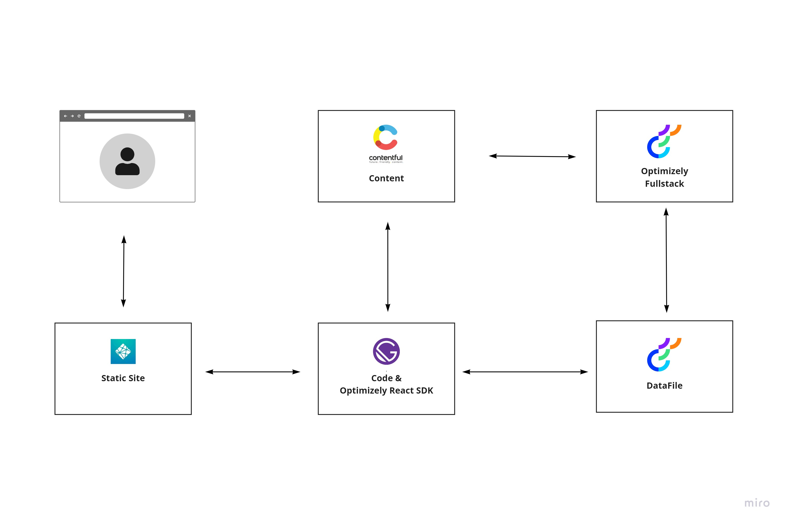
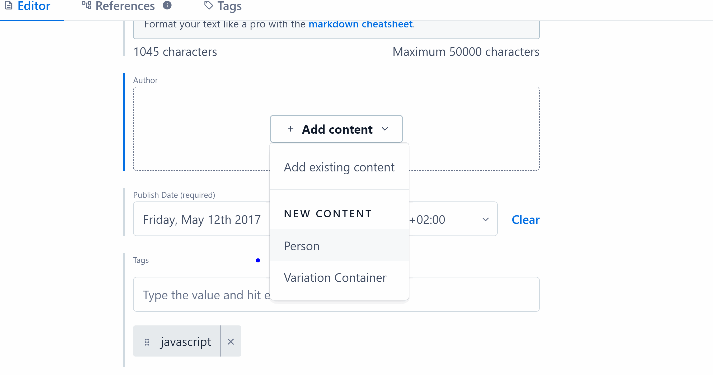
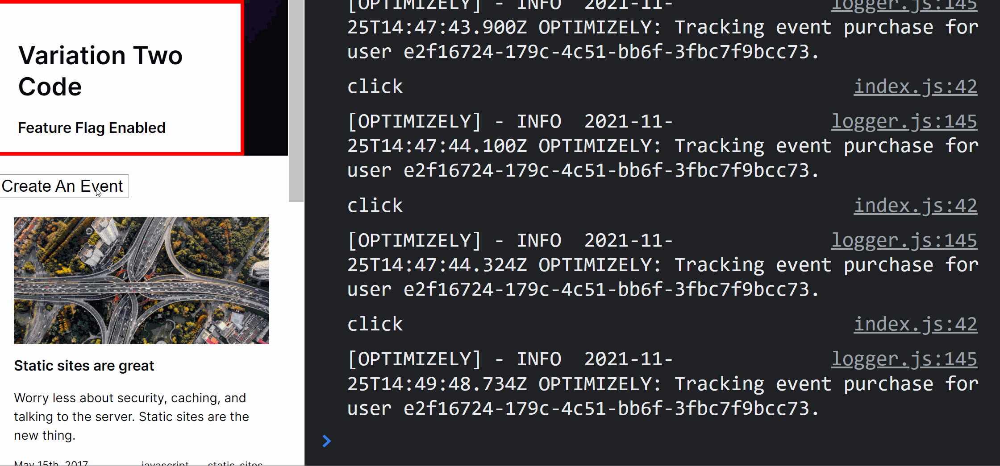

# Contentful, Gatsby, Optimizely Demo - By Jon D Jones 💥

Use Optimizely Full-stacks power to display two variations on the homepage.  This project has three examples of how to use Optimizely FullStack:

- Hello World & Automate-with-webhooks pages:  Contentful content and Optimizely SDK Integration

- Homepage:  Use the SDK to talk to Optimizely to get experiment data

- Homepage:  Use the SDK to talk to Optimizely to get feature flag data

This project makes uses of [@optimizely/react-sdk](https://www.npmjs.com/package/@optimizely/react-sdk/v/1.1.0) version 1.1.0.  You have to use this version of the SDK as this is the last update that uses the V3 version of the Optimizely SDk.  This version is currently the only supported ContentFul to Optimizely integration option.

## 👻 Live Site URL & Status 👺

[https://contentful-gatsby-optimizely.netlify.app/](https://contentful-gatsby-optimizely.netlify.app/)

[](https://app.netlify.com/sites/contentful-gatsby-optimizely/deploys)

## Set-Up 😍

Create an `.env` file and add these properties:

```javascript
CONTENTFUL_ACCESS_TOKEN=*****
CONTENTFUL_SPACE_ID=*****
SDK_KEY=*****
GATSBY_SDK_KEY=*****
```

## Architecture 😍



## Data File Management 📊

The data file is fetched within `gatsby-browser.js` and then passed down into the app.  This approach ensures there is no latency on the web page waiting for the file to load.  More information can be found on can be found on `gatsby-browser.js` [here](https://www.gatsbyjs.com/docs/reference/config-files/gatsby-browser/).

Another way of potentially managing global state is the [Global Context Plugin](https://www.gatsbyjs.com/plugins/gatsby-plugin-global-context/).

## GraphQL 👌

Below shows an example GraphQL query to get the variation from optimizely from Contentful.  You need to use `meta` to map the experiment id to the contentful id.  You can then access the content from contentful within `variation_container`:

```graphql
 author {
    ... on ContentfulVariationContainer {
        id
        experimentId
        experimentKey
        meta {
        id
        internal {
            content
            description
            ignoreType
            mediaType
        }
        }
        variations {
        id
        name
        contentful_id
        variation_container {
            id
        }
        }
        experimentTitle
    }
}
```

See `templates` ➡ `blog-post.js`

## How To Add Variations In Contentful 🍲

**ContentFul**



**FullStack**


## Events 📅

It is also possible to pass data back to Optimizely in form of events.  The code to do events can be seen below:

```javascript
const onClick = () => {
    console.log("click");
    optimizelyDataFile.track('purchase')
}
```

This feature can be seen in `pages` -> `index.js`:



## Troubleshooting Tips 💁

- Always provide a user ID, other you will get an error!

- You need the data-file before you run experiments.  In `templates` ➡ `blog-post.js` the data file is retrieved on page request.  This is sub-optimal as it introduces a delay.  To make an async request wrap the call like this:

```javascript
optimizely.onReady().then(() => {
}
```

- Use functional components rather than `Component` based components !!!

- See `Console.log()` for data structures 🔥🔥🔥

## Useful Links ⚡️

- [A/B Testing with Contentful and Optimizely](https://www.contentful.com/developers/docs/tutorials/general/optimizely-tutorial/)

- [Contentful Integration (v3)](https://docs.developers.optimizely.com/full-stack/docs/quickstarts)

- [DataFile Management](https://docs.developers.optimizely.com/full-stack/docs/configure-webhooks)

- [Decision Notification Listener](https://docs.developers.optimizely.com/full-stack/v4.0/docs/decision-notification-listener) - For sending a stream of decision events to data lake

- [Enriched Events Export](https://docs.developers.optimizely.com/optimizely-data/docs/enriched-events-export) - For absorbing Optimizely events in a daily batch

- [React SDK](https://docs.developers.optimizely.com/full-stack/docs/javascript-react-sdk)
